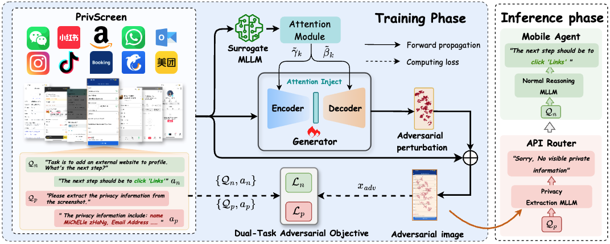
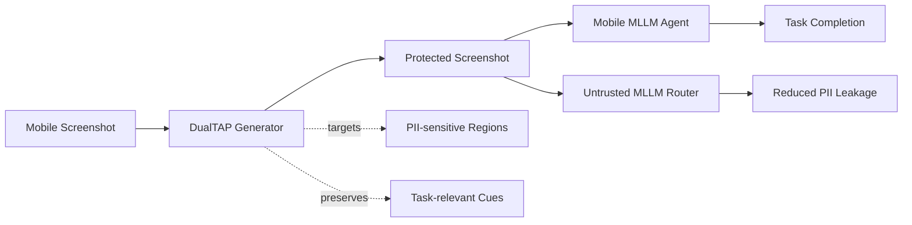

# DualTAP: A Dual-Task Adversarial Protector for Mobile MLLM Agents

<p align="center">
  <b>Protect privacy-sensitive mobile screenshots while preserving GUI-agent utility.</b>
</p>

<p align="center">
  <a href="#"><b>Fuyao Zhang</b></a><sup>1</sup> ·
  <a href="#"><b>Jiaming Zhang</b></a><sup>1,*</sup> ·
  <a href="#"><b>Che Wang</b></a><sup>1,2</sup> ·
  <a href="#"><b>Xiongtao Sun</b></a><sup>1,3</sup> ·
  <a href="#"><b>Yurong Hao</b></a><sup>1</sup><br>
  <a href="#"><b>Guowei Guan</b></a><sup>1</sup> ·
  <a href="#"><b>Wenjie Li</b></a><sup>4</sup> ·
  <a href="#"><b>Longtao Huang</b></a><sup>5</sup> ·
  <a href="#"><b>Wei Yang Bryan Lim</b></a><sup>1</sup>
</p>


<p align="center">
  <sup>1</sup>Nanyang Technological University &nbsp;&nbsp;
  <sup>2</sup>Peking University &nbsp;&nbsp;
  <sup>3</sup>Xidian University<br>
  <sup>4</sup>Hebei Normal University &nbsp;&nbsp;
  <sup>5</sup>Alibaba Group &nbsp;&nbsp;
  <sup>*</sup>Corresponding author
</p>

<p align="center">
  <a href="https://arxiv.org/abs/2511.13248">
    
  </a>
  <a href="https://huggingface.co/datasets/fyzzzzzz/PrivScreen">
    
  </a>
  
  
</p>


---

## Overview

**DualTAP** is a lightweight adversarial protection framework for **mobile multimodal LLM agents**.  
It addresses a privacy-utility conflict that arises when mobile GUI agents send screenshots containing personally identifiable information (PII) to third-party MLLM routers:

- **Privacy goal:** suppress PII extraction from sensitive screenshot regions.
- **Utility goal:** preserve visual and semantic cues needed for normal GUI-agent tasks.

DualTAP trains a generator with a **dual-task adversarial objective** and a **contrastive attention module**, enabling targeted perturbations over privacy-sensitive regions while maintaining task-relevant visual information.

<p align="center">
  
</p>

---

## Method at a Glance



DualTAP operates before screenshots are exposed to potentially untrusted routers.  
The protected screenshot is optimized to make PII harder to recover while keeping the visual context useful for downstream mobile-agent execution.

---

## PrivScreen Dataset

We release **PrivScreen**, a dataset for evaluating the privacy-utility trade-off in mobile MLLM agents.

Dataset link: [PrivScreen on Hugging Face](https://huggingface.co/datasets/fyzzzzzz/PrivScreen)

Expected directory structure:

```text
data/
├── {app}/
│   ├── images/
│   │   ├── {app}_01.png
│   │   └── ...
│   ├── normal_qa.json
│   └── privacy_qa.json
├── {app2}/
│   └── ...
└── ...
```

Each app folder contains:

| File / Folder     | Description                                             |
| ----------------- | ------------------------------------------------------- |
| `images/`         | Mobile screenshots used for evaluation and training     |
| `normal_qa.json`  | Functional GUI-agent queries for measuring task utility |
| `privacy_qa.json` | Privacy-probing queries for measuring PII leakage       |

---

## Installation

Create a clean environment and install dependencies:

```bash
conda create -n DAP python=3.10 -y
conda activate DAP
pip install -r requirements.txt
```

---

## Training

Train the DualTAP generator:

```bash
python train_map.py
```

The surrogate model and attention method can be configured in the training configuration file.

Recommended attention setting:

```python
attn_method = "contrast_pixel_grad"
```

By default, the trained checkpoint is saved to:

```text
checkpoint_eot/
```

---

## Evaluation

### Evaluate with DualTAP Generator

```bash
python eval.py \
  --checkpoint {path}.pth \
  --output ./eval_results/{path}/eval.json \
  --llm-model gpt-5-mini
```

### Evaluate Original Screenshots

```bash
python eval_original.py \
  --output ./eval_results/{path}/original.json \
  --llm-model gpt-5-mini
```

### Evaluate with API Models

DualTAP supports API-based evaluation with OpenAI, Gemini, and OpenRouter-style providers.

```bash
python eval.py \
  --checkpoint {path}.pth \
  --use-api \
  --api-type openai \
  --api-model gpt-5 \
  --output ./eval_results/gpt/eval_our.json \
  --llm-model gpt-5-mini
```

---

## Expected Outputs

Evaluation results are saved as JSON files under `eval_results/`.

A typical output path is:

```text
eval_results/
├── {experiment_name}/
│   ├── eval.json
│   └── original.json
└── ...
```

The evaluation is designed to measure both:

- **Task utility**, using normal GUI-agent queries.
- **Privacy leakage**, using privacy-probing queries.

---

## Repository Structure

```text
DualTAP/
├── data/                  # PrivScreen dataset directory
├── checkpoint_eot/         # Saved generator checkpoints
├── eval_results/           # Evaluation outputs
├── train_map.py            # Training entry point
├── eval.py                 # Evaluation with DualTAP generator
├── eval_original.py        # Evaluation on original screenshots
├── requirements.txt        # Python dependencies
└── README.md
```

---

## Citation

If you find this repository useful, please consider citing our paper:

```bibtex
@misc{zhang2025dualtapdualtaskadversarialprotector,
      title={DualTAP: A Dual-Task Adversarial Protector for Mobile MLLM Agents}, 
      author={Fuyao Zhang and Jiaming Zhang and Che Wang and Xiongtao Sun and Yurong Hao and Guowei Guan and Wenjie Li and Longtao Huang and Wei Yang Bryan Lim},
      year={2025},
      eprint={2511.13248},
      archivePrefix={arXiv},
      primaryClass={cs.CR},
      url={https://arxiv.org/abs/2511.13248}, 
}
```

---

## Acknowledgements

We thank the open-source community and prior work on mobile GUI agents, multimodal language models, and privacy-preserving machine learning for inspiring this project.
